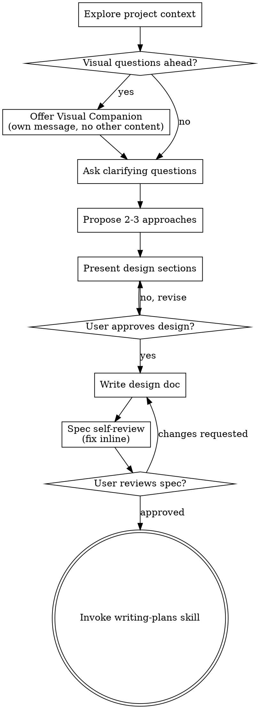

> 作者：大都督周瑜
> 公众号：IT周瑜
> 微信：it_zhouyu
> 

## 场景引入

前面我们安装了 Superpowers，了解了它的工作原理。现在来实战。

打开 Claude Code，输入：

```
我想开发一个手机号验证码登录注册 API
```

如果没有 Superpowers，Claude Code 大概率会直接开始写代码——创建项目、建文件、写 Controller。但安装了 Superpowers 后，你会看到完全不同的行为：

```
I'm using the brainstorming skill to explore your idea before we start building.

Let me first check the current project context...
```

Claude Code 没有动手写代码，而是先声明使用了 `brainstorming` Skill，然后开始探索项目上下文。这是怎么回事？

## brainstorming 为什么会自动触发

回顾前面文章讲的 `using-superpowers` 引导流程。技能检查流程的 DOT 流程图是：

```
用户发消息 → "有 Skill 可能适用吗？"
                    ├─ 是（哪怕 1%）→ 调用 Skill → "有 Checklist 吗？"
                    │                                    ├─ 是 → 为每项创建 Todo
                    │                                    └─ 否 → 直接执行
                    └─ 确定没有 → 直接回复
```

文章里还提到：**当 AI 想进入 Plan Mode 时，流程图会先拦截检查"有没有做过 brainstorming"——如果没有，先触发 brainstorming。**

当你输入"我想开发一个 API"，Claude Code 的第一反应是进入 Plan Mode（规划模式）。但引导流程在它进入 Plan Mode 之前拦截了一下：**你做过 brainstorming 了吗？** 没做过？先做 brainstorming。

这就是为什么 brainstorming 会自动触发——不是 Claude Code "聪明"，而是 Superpowers 的引导流程在 Plan Mode 入口处设了一道关卡。

## HARD-GATE：设计批准前不能写代码

brainstorming Skill 里有一段用 `<HARD-GATE>` 标签包裹的硬性规则：

```
Do NOT invoke any implementation skill, write any code, scaffold any project,
or take any implementation action until you have presented a design and the
user has approved it. This applies to EVERY project regardless of
perceived simplicity.
```

翻译过来就是：**在用户批准设计之前，不能写任何代码，不能建项目，不能做任何实现动作。无论项目多"简单"。**

Skill 还特别点出了一个反面模式：

> ## Anti-Pattern: "This Is Too Simple To Need A Design"
>
> Every project goes through this process. A todo list, a single-function utility, a config change — all of them. "Simple" projects are where unexamined assumptions cause the most wasted work. The design can be short (a few sentences for truly simple projects), but you MUST present it and get approval.

翻译：每个项目都走这个流程。一个 todo list、一个单函数工具、一个配置修改——全部都要。"简单"项目恰恰是未审查假设造成最多浪费的地方。

这个设计背后有一个洞察：**AI 倾向于把"简单"当作跳过流程的借口**。Superpowers 通过大量测试发现，AI 说"这太简单了"的时候，往往是最容易出问题的时候。所以 HARD-GATE 对所有项目一视同仁。

## 9 步 Checklist

brainstorming Skill 定义了一个 9 步 Checklist，Claude Code 会为每一步创建 Todo：

1. **Explore project context** — 检查文件、文档、最近提交
2. **Offer visual companion** — 如果后续问题涉及视觉内容，单独一条消息询问是否使用浏览器辅助
3. **Ask clarifying questions** — 逐个提问，理解目的/约束/成功标准
4. **Propose 2-3 approaches** — 带权衡分析和推荐方案
5. **Present design** — 按复杂度分段展示设计，每段获取用户批准
6. **Write design doc** — 保存到 `docs/superpowers/specs/` 并提交 git
7. **Spec self-review** — 自查占位符、矛盾、歧义、范围
8. **User reviews written spec** — 用户审查设计文档
9. **Transition to implementation** — 调用 writing-plans Skill 创建实现计划

这 9 步用 DOT 流程图定义了严格的顺序和分支，原版如下：



接下来我们用 auth API 的场景，逐步演示每一步的实际对话。

## Step 1：探索项目上下文

Claude Code 首先会自动检查当前目录的状态：

```
Let me explore the current project context...
```

它会查看：
- 当前目录下有什么文件（如果有）
- 有没有 git 仓库
- 有没有已有的项目配置（pom.xml、package.json 等）
- 最近的 git 提交

假设我们在一个空目录中操作，Claude Code 发现这是一个全新的项目，没有已有代码。它会继续下一步。

如果目录中已有项目呢？Claude Code 会分析现有架构，后续的设计会基于现有代码结构来提出方案。brainstorming Skill 明确要求"在已有代码库中工作时，先探索现有结构，遵循既有模式"。

## Step 2：Visual Companion（可选）

brainstorming 有一个 Visual Companion 功能——一个浏览器端的辅助工具，可以在设计讨论中展示 mockup、图表等可视化内容。

由于我们开发的是后端 API，不涉及 UI，所以这一步会被跳过。但如果你的项目涉及前端界面，Claude Code 会单独发一条消息询问：

```
Some of what we're working on might be easier to explain if I can show it
to you in a web browser. I can put together mockups, diagrams, comparisons,
and other visuals as we go. Want to try it?
```

注意 Skill 的要求：**这条消息必须单独发送，不能和其他内容（比如提问）混在一起**。这是一个精心设计的约束——避免用户被过多的信息轰炸。

## Step 3：逐个提问澄清需求

这是 brainstorming 最核心的部分。Claude Code 会一个一个地提问，帮你把模糊的想法变成明确的需求。

**关键规则：每次只问一个问题，优先用多选题。**

实际的对话可能像这样：

**Claude Code：**
```
验证码怎么发送给用户？

A. 真正调用短信服务发送（如阿里云 SMS）
B. 开发阶段模拟发送，验证码固定为 123456
C. 控制台打印验证码，方便调试
```

你选择 B。接着下一个问题：

**Claude Code：**
```
新用户注册和已有用户登录走同一个接口吗？

A. 是，一个接口同时处理注册和登录（手机号不存在则自动注册）
B. 分开，/register 和 /login 是两个独立接口
```

你选择 A。再下一个问题：

**Claude Code：**
```
认证成功后返回什么凭证？

A. JWT Token（无状态，服务端不存 session）
B. Session + Cookie（服务端存 session）
C. OAuth2 Token
```

你选择 A。

为什么每次只问一个？因为 brainstorming Skill 经过测试发现：AI 倾向于一次问多个问题，用户容易遗漏或混淆。一次一个问题的节奏虽然慢，但能确保每个决策都经过深思熟虑。

## Step 4：提出 2-3 种方案

问完需求后，Claude Code 不会只给一个方案，而是提出 2-3 种方案并给出推荐。

```
基于你的需求，我看到三种实现方案：

## 方案 A：Spring Boot + 内存 Map + JWT（推荐）
- 用 ConcurrentHashMap 存储用户和验证码
- JWT 做无状态认证
- 零外部依赖，开箱即用
- 优点：简洁、无数据库配置、适合学习和原型
- 缺点：重启数据丢失，不适合生产

## 方案 B：Spring Boot + H2 内存数据库 + JWT
- 用 H2 替代 ConcurrentHashMap
- 有完整的 JPA 数据层
- 优点：数据层更规范，容易迁移到真实数据库
- 缺点：增加配置复杂度，对当前需求过度设计

## 方案 C：Spring Boot + MySQL + Spring Security + JWT
- 完整的生产级方案
- 优点：生产就绪
- 缺点：环境复杂（需要 MySQL），学习成本高，YAGNI

我推荐方案 A。理由：当前目标是学习和演示，内存存储足够。
```

注意推荐的写法：先给出推荐，再解释理由。这是 brainstorming Skill 的要求——"Lead with your recommended option and explain why"。

Skill 还有一个重要原则叫 **YAGNI**（You Aren't Gonna Need It，你不会需要它）。方案 B 和 C 的缺点本质上都是"过度设计"。brainstorming 要求在每个方案中都用 YAGNI 原则审视——你现在不需要的东西，就不要加。

## Step 5：分段展示设计，逐步获批准

你同意方案 A 后，Claude Code 开始分段展示详细设计。

**第一段：API 设计**
```
## API 设计

三个接口：

1. POST /auth/send-code
   - 入参：{ "phone": "13800138000" }
   - 逻辑：生成验证码，存入内存（开发阶段固定 123456）
   - 返回：{ "message": "验证码已发送" }

2. POST /auth/verify
   - 入参：{ "phone": "13800138000", "code": "123456" }
   - 逻辑：校验验证码，手机号不存在则自动创建用户，返回 JWT
   - 返回：{ "token": "eyJhbG...", "isNewUser": true }

3. GET /auth/me
   - Header：Authorization: Bearer <token>
   - 逻辑：解析 JWT，返回用户信息
   - 返回：{ "phone": "13800138000", "nickname": "用户_3800" }

这部分看起来对吗？
```

你确认没问题。接着下一段。

**第二段：数据结构**
```
## 数据结构

内存中用两个 ConcurrentHashMap：

// 验证码存储：手机号 → 验证码
ConcurrentHashMap<String, String> codeStore

// 用户存储：手机号 → 用户对象
ConcurrentHashMap<String, User> userStore

User 对象：
{
  "id": UUID,
  "phone": "13800138000",
  "nickname": "用户_3800",  // 自动生成
  "createdAt": Instant
}
```

每一段都会等你确认后才继续。这是 brainstorming 的"增量验证"原则——不要到最后才发现问题。

**第三段：错误处理**
```
## 错误处理

- 手机号格式无效 → 400 Bad Request
- 验证码错误 → 401 Unauthorized
- 验证码过期（5分钟）→ 401 Unauthorized
- Token 无效/过期 → 401 Unauthorized
- 未提供 Token → 401 Unauthorized
```

全部确认后，设计阶段完成。

## Step 6：写设计文档

设计确认后，Claude Code 会把完整设计写成文档，保存到项目中：

```
docs/superpowers/specs/2026-06-03-auth-api-design.md
```

文档包含你刚才确认的所有内容：API 设计、数据结构、错误处理、技术选型理由。然后 Claude Code 会把这个文档提交到 git。

为什么要写文档？因为下一步的实现计划和代码审查都需要一个**书面基准**。口头确认的东西容易遗忘或产生歧义，文档让所有后续步骤都有据可查。

## Step 7：Spec 自审查

文档写完后，Claude Code 不会直接把它交给你，而是先自己做一轮检查。brainstorming Skill 定义了 4 项自审：

**1. 占位符扫描**：检查文档中有没有 "TBD"、"TODO"、"待定" 这样的占位符。有就立刻补上。

**2. 内部一致性**：各章节之间有没有矛盾？比如 API 设计里说"返回 JWT"，但数据结构里没定义 Token 的签发逻辑——这就是不一致。

**3. 范围检查**：这个设计是否聚焦到可以用一个实现计划覆盖？还是太大需要拆分？我们的 auth API 聚焦在认证功能，没有涉及用户管理、权限系统等额外功能，范围合适。

**4. 歧义检查**：有没有可以被两种方式理解的需求？比如"验证码过期"——是 5 分钟还是 30 分钟？必须明确。发现歧义就立刻写清楚。

这一步的设计哲学是：**让 AI 自己先当一遍审查者**，把能发现的问题先修掉，减少人类审查的负担。这不是替代人类审查，而是在提交给人类之前先做一轮基础检查。

## Step 8：用户审查设计文档

自审通过后，Claude Code 会把文档路径告诉你，请你审查：

```
Spec written and committed to docs/superpowers/specs/2026-06-03-auth-api-design.md.
Please review it and let me know if you want to make any changes before we
start writing out the implementation plan.
```

这时候你可以打开文档仔细看。如果发现问题，告诉 Claude Code，它会修改后重新自审。只有你明确说"没问题"后，才会进入下一步。

回看上面的 DOT 流程图，`"User reviews spec?"` 节点有两个分支：`changes requested` 回到 `"Write design doc"` 重新修改，`approved` 走向 `"Invoke writing-plans skill"`。

## Step 9：自动衔接 writing-plans

你批准设计后，Claude Code 会自动调用 `writing-plans` Skill，开始写实现计划。注意这个衔接是**有约束的**——brainstorming Skill 明确说：

> **The terminal state is invoking writing-plans.** Do NOT invoke frontend-design, mcp-builder, or any other implementation skill. The ONLY skill you invoke after brainstorming is writing-plans.

这意味着 brainstorming 结束后只能走向 writing-plans，不能跳到其他实现类 Skill。这个约束保证了一个线性的流程：

```
brainstorming → writing-plans → implementation
```

而不是：

```
brainstorming → 直接写代码（跳过计划）
```

## 回顾：brainstorming 的设计哲学

brainstorming Skill 的 9 步流程看起来很"重"，但每一步都有明确的设计意图：

| 规则 | 为什么 |
|------|--------|
| HARD-GATE，设计批准前不能写代码 | 防止 AI 急着实现，用户需求都没搞清楚 |
| 每次只问一个问题 | 多个问题容易遗漏，一个一个确认更可靠 |
| 优先多选题 | 降低用户思考负担，快速收敛需求 |
| 提出 2-3 种方案 | 避免只有一个方案时缺少对比视角 |
| 分段展示设计 | 逐步确认，问题早发现早修改 |
| 写文档 + 自审 | 书面基准 + 机器预检，减少人类审查负担 |
| 只能衔接 writing-plans | 防止跳过计划直接实现 |
| YAGNI 原则 | 过度设计是浪费，当前不需要的功能不加 |

这套规则不是凭空设计的，而是 Superpowers 在大量实际使用中测试出来的。每个"为什么"背后都有真实的失败案例——比如 AI 一次问 5 个问题导致用户只回答了 3 个，比如"太简单不需要设计"的项目最后返工了 3 次。
