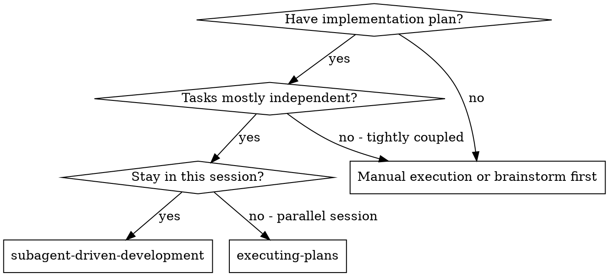
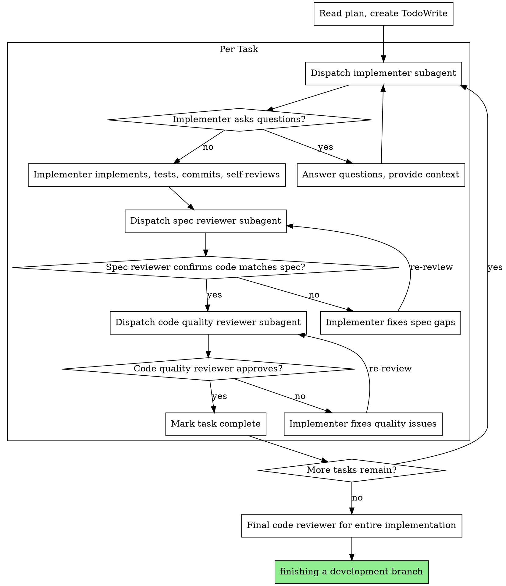

> 作者：大都督周瑜
> 公众号：IT周瑜
> 微信：it_zhouyu
> 

## 选择子代理驱动

前面最后，你选择了 Subagent-Driven 执行方式。Claude Code 会声明：

```
I'm using Subagent-Driven Development to execute this plan.
```

然后它会做三件事：
1. 读取计划文件，提取所有 Task 的完整文本
2. 为所有 Task 创建 Todo 列表
3. 开始逐个派发子代理执行

从这一刻起，你的角色从"对话者"变成了"监督者"。Claude Code 会自动执行所有任务，不需要你每步确认。

Skill 用一个 DOT 流程图定义了什么时候该用子代理模式：



三个条件缺一不可：有实现计划、任务基本独立、留在当前会话。

**条件 1：是否有实现计划？** 没有 → 先做 brainstorming 或手动执行。有 → 继续。

**条件 2：任务是否基本独立？** 不独立（任务之间强耦合）→ 不适合子代理模式，回到手动执行。独立 → 继续。

**条件 3：是否留在当前会话？** 是 → 走 `subagent-driven-development`，在当前会话中派发子代理。否 → 走 `executing-plans`，在当前会话中串行执行，不派发子代理。

"留在当前会话"是什么意思？subagent-driven 模式下，当前 Claude Code 会话负责派发子代理，每个 Task 派一个；executing-plans 模式下，当前会话自己按步骤串行执行，不派发子代理。两种方式都在当前会话中进行，区别在于是否产生子代理。

## 子代理是什么

子代理（Subagent）是 Claude Code 的一个核心能力：**在当前会话中派发一个全新的、独立的 AI 代理来执行任务**。

关键特性：**子代理不继承当前会话的上下文**。

这是 Claude Code 平台层面的机制——子代理拿到的是一个全新上下文，只有当前会话通过 prompt 传给它的内容。

> 补充：Claude Code 的 `/fork` 命令（即 `/branch`）可以在保留当前会话上下文的情况下创建新的分支会话。

这意味着什么？你和 Claude Code 已经聊了很多——从 brainstorming 到设计到计划，会话上下文中积累了大量内容。但子代理看不到这些。它只能看到当前会话传给它的任务文本。

这个设计是有意的。子代理的上下文隔离有两个好处：

**1. 避免上下文污染。** 如果子代理能看到你之前讨论中被否决的方案 B，它可能会在实现中混入方案 B 的内容。隔离上下文确保它只按计划执行。

**2. 保持当前会话轻量。** 当前会话不需要把所有历史传给每个子代理，只需要提供任务相关的精确上下文。这让当前会话有更多空间做协调工作。

## 三角色协作模型

subagent-driven-development 定义了三个角色，每个角色由不同的子代理担任：

### Implementer（实现者）

拿到任务文本 → 理解需求 → 写代码 → 运行测试 → 提交 → 自审

实现者是"干活的人"。它拿到的是一个具体的 Task（前面文章里写的那些 Step 1-5），然后按步骤执行。如果遇到不明确的地方，它可以向当前会话提问——在开始工作之前。

### Spec Reviewer（规格审查者）

检查代码是否**符合规格要求**——不多不少。

Spec Reviewer 不关心代码写得好不好，它只关心：
- 规格要求的功能有没有实现？
- 有没有实现规格之外的东西？（过度构建）
- 有没有遗漏规格里的要求？（构建不足）

### Code Quality Reviewer（质量审查者）

检查代码**质量**——不是功能对不对，而是写得好不好。

质量审查关注：代码可读性、命名规范、重复代码、潜在 bug、性能问题等。

### 为什么需要两级审查

你可能会问：一个审查者不够吗？为什么要分 Spec Review 和 Code Quality Review？

因为它们回答的是不同的问题：

| 审查类型 | 回答的问题 | 失败意味着 |
|---------|-----------|-----------|
| Spec Review | "做了该做的事吗？" | 功能不对，返工 |
| Code Quality Review | "事情做得好吗？" | 质量欠佳，技术债 |

更重要的是**顺序不能错**。subagent-driven-development 明确说：

> Never start code quality review before spec compliance is ✅

如果 Spec Review 没通过，代码可能还在改（增删功能），此时做 Code Quality Review 是浪费时间——改完之后代码又变了，之前的审查意见可能不再适用。

完整的 Per Task 流程用原版 DOT 流程图定义：



流程解读：

1. **Spec Reviewer 什么时候触发**：Implementer（即单个任务的执行者）完成实现、测试、提交、自审后，当前会话立即派发 Spec Reviewer。它拿到规格文本和 Implementer 的 git diff，逐项对比。
2. **Code Quality Reviewer 什么时候触发**：Spec Reviewer 通过（✅）后，当前会话才派发 Code Quality Reviewer。Spec Review 没通过就不做质量审查——代码还可能改，审查了也白审。
3. **不通过怎么办**：审查发现问题 → Implementer 修复 → 同一个 Reviewer 重新审查，直到通过。

每个 Task 都走这个三步循环。所有 Task 完成后做一次最终全局审查，然后进入分支收尾。

## 实操：Task 1 — 项目初始化

现在来看实际执行过程。auth API 的 Task 1 是项目初始化：创建 Spring Boot 项目、配置 pom.xml、建目录结构。

### 派发 Implementer

当前会话构造一个精确的 prompt 给实现者子代理：

```
你是一个实现工程师。请按以下任务执行：

### Task 1: Spring Boot 项目初始化

**Files:**
- Create: pom.xml
- Create: src/main/java/com/example/auth/AuthApplication.java
- Create: src/test/java/com/example/auth/AuthApplicationTest.java

[完整的 Step 1-5 内容...]

项目根目录：/Users/xxx/auth-api
技术栈：Java 17, Spring Boot 3.x, Maven
```

注意当前会话**没有把整个计划文件传给子代理**——只传了 Task 1 的内容。subagent-driven-development 明确说：

> [FULL TEXT of task from plan - paste it here, don't make subagent read file]

意思是把**这个 Task 的完整内容**粘贴进 prompt，不要让子代理自己去读计划文件。子代理拿到完整文本后不需要再去读文件。

### Implementer 执行

子代理开始工作：

```
Implementer:
- 创建 pom.xml（Spring Boot 3.2.0, Java 17, spring-boot-starter-web）
- 创建 AuthApplication.java（@SpringBootApplication）
- 创建 AuthApplicationTest.java（@SpringBootTest, 测试上下文加载）
- 运行 mvn test → 1/1 pass
- 自审：发现 pom.xml 中没有 spring-boot-starter-test，已添加
- 提交：git commit -m "feat: init Spring Boot project"

Status: DONE
```

### 派发 Spec Reviewer

当前会话派发规格审查子代理：

```
你是规格审查者。检查以下实现是否符合规格要求。

规格：
[Task 1 的规格描述]

请检查：
1. 所有规格要求是否都已实现
2. 是否有规格之外的功能被实现
3. 文件结构是否符合规格

Git diff:
[Implementer 提交的 diff]
```

Spec Reviewer 返回：

```
Spec Reviewer: ✅ Spec compliant
- pom.xml 包含所有必需依赖
- 启动类正确创建
- 测试框架正确配置
- 没有多余的实现
```

### 派发 Code Quality Reviewer

通过 Spec Review 后，当前会话派发质量审查子代理。质量审查需要拿到 git SHA 来看具体的代码变更。

```
Code Quality Reviewer:
Strengths: 项目结构清晰，依赖版本管理合理
Issues: None
Approved: ✅
```

### 标记完成

两级审查都通过后，Task 1 标记为完成，进入 Task 2。

## 实操：Task 2 — POST /auth/send-code（完整循环）

Task 2 更复杂，用来展示完整的审查循环。

### Implementer 遇到问题

```
Implementer: "Before I begin — 验证码有效期多久？规格里没提到。"
```

子代理在实现前发现了一个规格遗漏。这不是 Spec Review 的结果——Spec Review 还没开始。这是 Implementer 自己在读任务文本时，发现"验证码有效期"没提到，按照 "Before You Begin" 规则在动手前先提问。当前会话需要回答：

```
Controller: "开发阶段验证码固定为 123456，有效期 5 分钟。"
```

子代理拿到答案后继续工作。

### Spec Reviewer 发现问题

```
Spec Reviewer: ❌ Issues:
- Missing: 手机号格式校验的错误响应格式（规格要求返回 400 + 具体错误信息）
- Extra: 添加了 @JsonIgnore 注解在 phone 字段上（规格未要求）
```

审查者发现了两个问题：一个遗漏（手机号校验的错误响应不符合规格），一个多余（不该加的注解）。

### Implementer 修复

```
Implementer:
- 移除 @JsonIgnore 注解
- 添加全局异常处理器，返回 400 + 具体错误信息
- 运行测试 → 全部通过
- 提交修复
```

### Spec Reviewer 重新审查

```
Spec Reviewer: ✅ Spec compliant now
```

### Code Quality Reviewer 发现问题

```
Code Quality Reviewer:
Strengths: 接口设计清晰，DTO 使用 record 很简洁
Issues (Important): 手机号正则写死在注解中，应该提取为常量
```

质量审查发现了一个代码质量问题。severity 是 Important，需要修复。

### Implementer 修复 → Quality Reviewer 通过

```
Implementer: 提取 PHONE_PATTERN 常量到 SendCodeRequest

Code Quality Reviewer: ✅ Approved
```

Task 2 完成。注意这个循环：实现 → 规格审查 → 修复 → 重新规格审查 → 质量审查 → 修复 → 重新质量审查。**每个问题都要闭环**，不能跳过。

## 连续执行原则

subagent-driven-development 有一个反直觉的规则：**不在任务之间暂停检查**。

> Do not pause to check in with your human partner between tasks. Execute all tasks from the plan without stopping.

为什么？因为用户选择执行计划就意味着"我相信这个计划，你去执行"。如果每完成一个任务就停下来问"继续吗？"，反而浪费用户时间。

只在以下三种情况才停止：
- **BLOCKED**：子代理被阻塞，当前会话也无法解决
- **歧义**：出现计划无法覆盖的情况
- **全部完成**：所有任务执行完毕

如果你希望每步确认，应该选择 Inline Execution（内联执行）而不是 Subagent-Driven。

## 模型选择策略

不是每个子代理都需要最强的模型。subagent-driven-development 给出了明确的模型选择策略：

| 任务类型 | 模型选择 | 例子 |
|---------|---------|------|
| 机械实现（1-2 文件，规格明确） | 便宜快速的模型 | DTO 创建、简单的 CRUD 接口 |
| 集成任务（多文件协调） | 标准模型 | 跨层调用、认证过滤器配置 |
| 架构/设计/审查 | 最强模型 | Spec Review、Code Quality Review |

为什么审查要用最强模型？因为审查需要理解整个规格的意图，判断代码是否偏离——这需要更强的推理能力。而实现一个规格已经非常明确的 DTO，用便宜模型就够了。

这个策略的底层逻辑是：**计划做得越好（越详细），实现就越机械，就越不需要强模型**。writing-plans 的 No Placeholders 规则和 2-5 分钟粒度，本质上都是为了让实现变成"机械操作"，从而可以用便宜模型执行。

## 处理 Implementer 状态

子代理完成任务后会返回一个状态。当前会话需要根据状态做不同处理：

**DONE**：一切顺利，进入审查流程。

**DONE_WITH_CONCERNS**：完成了，但有疑虑。当前会话需要先看疑虑内容再决定。如果疑虑是关于正确性或范围的，要先解决。如果只是观察性意见（比如"这个文件有点大了"），记下来，继续审查。

**NEEDS_CONTEXT**：子代理缺少信息。当前会话补充上下文，重新派发。比如 Task 3 的实现者可能问"JWT 签名密钥用什么？"——当前会话需要回答后重新派发。

**BLOCKED**：子代理被卡住了。当前会话的处理顺序：
1. 是上下文问题？补充上下文，同一模型重新派发
2. 是任务需要更多推理？换更强的模型重新派发
3. 是任务太大？拆分成更小的子任务
4. 是计划本身有问题？上报给用户

关键规则：**永远不要忽略子代理的阻塞报告**。如果子代理说它被卡住了，一定是哪里出了问题。强制同一个模型重试而不做任何改变，只会得到同样的结果。

## 最终审查

所有任务执行完后，subagent-driven-development 还有一个最终步骤：**派发一个最终的代码审查子代理，审查整个实现**。

这个审查不是逐任务的，而是从全局视角看：
- 各个 Task 的实现是否协调一致
- 有没有集成问题
- 整体代码质量是否达标

最终审查通过后，自动调用 `finishing-a-development-branch` Skill 进入分支收尾流程。

## 子代理模式的代价

子代理驱动开发不是免费的。它有一些明确的代价：

**更多的子代理派发**：每个任务需要派发 3 个子代理（实现者 + 规格审查 + 质量审查），加上可能的修复循环。5 个任务至少需要 15 次子代理派发。SKILL.md 原文也明确说了：

> More subagent invocations (implementer + 2 reviewers per task)

**当前会话的准备工作**：当前会话需要在派发前提取每个任务的完整文本，构造精确的上下文。这比直接执行需要更多的前期工作。

**审查循环的迭代成本**：审查发现问题 → 修复 → 重新审查，可能需要多轮。

但 Superpowers 认为这些代价是值得的，理由是：**在上游捕获问题的成本远低于在下游调试的成本**。一个 Spec Reviewer 发现的遗漏，修复只需要几分钟；如果带到集成测试甚至生产环境，修复成本可能是几小时甚至几天。

## 回顾：子代理驱动开发的关键规则

| 规则 | 原因 |
|------|------|
| 子代理不继承当前会话上下文 | Claude Code 平台机制，避免上下文污染 |
| 两级审查，顺序不能错 | Spec 先行，避免在错误的代码上做质量审查 |
| 审查发现问题必须闭环 | 修复后重新审查，不能跳过 |
| 连续执行，不暂停 | 用户选择执行就是授权，不反复确认 |
| 当前会话构造精确上下文 | 子代理只看得到你给它的内容 |
| 模型按任务复杂度选择 | 节约成本，加速执行 |
