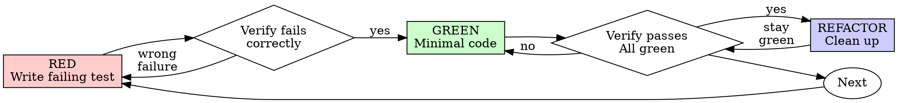

> 作者：大都督周瑜
> 公众号：IT周瑜
> 微信：it_zhouyu
> 

## TDD 的 Iron Law

Superpowers 的 `test-driven-development` Skill 开篇就定了一条铁律：

```
NO PRODUCTION CODE WITHOUT A FAILING TEST FIRST
```

没有失败测试就没有生产代码。先写代码了？删掉重来。

Skill 甚至规定了"删掉"的严格程度：

> Don't keep it as "reference". Don't "adapt" it while writing tests. Don't look at it. Delete means delete.

为什么这么极端？因为 Superpowers 在大量测试中发现了一个模式：**AI 说"我先写代码作参考"的时候，实际上是在绕过 TDD**。写出来的代码会潜移默化地影响后续测试的设计，测试变成"验证已有代码"而不是"定义期望行为"。

## RED-GREEN-REFACTOR 循环

TDD Skill 用 DOT 流程图定义了一个严格的循环，原版如下：



流程解读：RED（写失败测试）→ 验证失败（确认是正确的失败）→ GREEN（写最小实现）→ 验证通过 → REFACTOR（清理）→ 验证仍然通过 → 下一个测试。注意菱形判断节点：如果验证失败时发现是"错误的失败"（测试本身写错了），要回到 RED 重写测试。

我们用 auth API 的 `GET /auth/me` 接口来演示这个循环。假设已经实现了发送验证码和验证接口，现在要加"获取当前用户信息"功能。

### RED：写失败测试

```java
@Test
void shouldReturnUserInfoWithValidToken() throws Exception {
    // 先通过 verify 接口获取 token
    String token = obtainToken("13800138000", "123456");

    mockMvc.perform(get("/auth/me")
            .header("Authorization", "Bearer " + token))
        .andExpect(status().isOk())
        .andExpect(jsonPath("$.phone").value("13800138000"))
        .andExpect(jsonPath("$.nickname").exists());
}
```

运行测试：

```bash
$ mvn test -Dtest=AuthControllerTest#shouldReturnUserInfoWithValidToken

FAIL: status expected:<200> but was:<404>
```

测试失败了。**验证失败是强制的**。TDD Skill 说：

> MANDATORY. Never skip.

为什么要看它失败？因为测试通过意味着你测的是已有行为，不是新功能。看到正确的失败（404 而不是编译错误），说明测试写对了。

### GREEN：写最小实现

```java
@GetMapping("/me")
public ResponseEntity<ApiResponse> getCurrentUser(
        @RequestHeader("Authorization") String authHeader) {
    String token = authHeader.replace("Bearer ", "");
    String phone = jwtService.extractPhone(token);
    User user = authService.findByPhone(phone);
    return ResponseEntity.ok(ApiResponse.success("获取成功", user));
}
```

运行测试：

```bash
$ mvn test -Dtest=AuthControllerTest#shouldReturnUserInfoWithValidToken

PASS
```

注意这个实现只做了让测试通过的最少工作。没有错误处理、没有 Token 过期检查、没有参数校验。**GREEN 阶段只求通过，不求完美。**

### REFACTOR：清理

现在测试通过了，可以安全地重构。比如把 Token 解析逻辑从 Controller 提取到一个过滤器中：

```java
@Component
public class JwtAuthFilter extends OncePerRequestFilter {
    @Override
    protected void doFilterInternal(HttpServletRequest request,
            HttpServletResponse response, FilterChain chain) {
        String token = extractToken(request);
        if (token != null) {
            String phone = jwtService.extractPhone(token);
            // 设置认证上下文
        }
        chain.doFilter(request, response);
    }
}
```

重构后重新运行测试，确认仍然通过。REFACTOR 阶段的规则是"保持绿色，不加行为"。

### REFACTOR 失败了怎么办

重构不是总是顺利的。假设我们把 Token 解析移到 `JwtAuthFilter` 后，运行测试：

```bash
$ mvn test

Tests run: 4, Failures: 1
FAIL: shouldReturnUserInfoWithValidToken
  Expected status:<200> but was:<401>
```

测试红了。这说明重构破坏了行为。此时回到流程图的 `verify_green` 节点——它有一条回退路径。

REFACTOR 失败时的处理步骤：

1. **不要继续重构**。停下当前的重构。
2. **不要写新测试**。问题不是缺测试，而是重构搞坏了东西。
3. **回退到重构前的状态**。用 `git checkout` 恢复到 REFACTOR 之前的代码。
4. **重新分析重构方案**。搞清楚为什么过滤器引入后 Controller 的测试 401 了——可能是因为测试没有配置 Spring Security 的 FilterChain，导致请求被拦截。

```bash
# 回退到重构前
$ git checkout -- src/main/java/com/example/auth/
```

然后修正重构方案——在测试中配置过滤器：

```java
@SpringBootTest
@AutoConfigureMockMvc
@Import(JwtAuthFilter.class)  // 引入过滤器
class AuthControllerTest {
    // ...
}
```

再次运行测试，全部通过。现在 REFACTOR 成功了。

关键原则：**REFACTOR 阶段只改结构，不改行为。如果测试红了，说明你改了行为（或者漏了配置），必须立即回退。**

### 循环什么时候结束

一个 RED-GREEN-REFACTOR 循环只解决一个测试。但一个功能通常需要多个测试。`GET /auth/me` 这个接口，至少需要覆盖这些场景：

| 测试 | 验证什么 |
|------|---------|
| `shouldReturnUserInfoWithValidToken` | 正常情况 |
| `shouldRejectExpiredToken` | Token 过期 |
| `shouldRejectInvalidToken` | Token 无效 |
| `shouldRejectMissingToken` | 不带 Token |
| `shouldReturnUserInfoWithCorrectFields` | 返回字段完整 |

每个场景都是一次完整的循环。整体流程如下：

```
循环 1: shouldReturnUserInfoWithValidToken → RED → GREEN → REFACTOR
循环 2: shouldRejectExpiredToken → RED → GREEN → REFACTOR
循环 3: shouldRejectInvalidToken → RED → GREEN → REFACTOR
循环 4: shouldRejectMissingToken → RED → GREEN → REFACTOR
循环 5: shouldReturnUserInfoWithCorrectFields → RED → GREEN → REFACTOR
```

**什么时候停？** 当你再也想不出能暴露新 bug 的测试时，循环结束。实际操作中的判断标准：

1. **正常路径**覆盖了（happy path）
2. **所有边界条件**覆盖了（空值、边界、异常）
3. **所有错误路径**覆盖了（无权限、参数错误、资源不存在）
4. 再写新测试，**要么冗余（测的是已覆盖的行为），要么通过（没有暴露新问题）**

回到流程图，`next` 节点连回 `red`。当你在 RED 阶段写不出新的失败测试时，循环自然终止——不是靠"感觉差不多了"停下来，而是靠"再也找不到能让它失败的方式"来确认完成。

## 为什么顺序重要

TDD Skill 有一段精辟的对比：

| 测试后写 | 测试先写 |
|---------|---------|
| 回答"这做了什么？" | 回答"这应该做什么？" |
| 受实现影响，验证的是你写的代码 | 独立于实现，定义的是期望行为 |
| 覆盖你记得的边界情况 | 发现你没考虑到的边界情况 |
| 通过即通过，什么都没证明 | 先失败再通过，证明测试真的能抓到问题 |

**"我之后再补测试"**——TDD Skill 对此的反驳是：

> 30 minutes of tests after ≠ TDD. You get coverage, lose proof tests work.

后补的测试 100% 会通过（因为代码已经写了），通过证明不了任何事。只有先看到测试失败再看到通过，才能证明测试确实测到了正确的东西。

## 常见自我辩解表

TDD Skill 列出了 11 种常见的跳过 TDD 的借口，原版如下：

| Excuse | Reality |
|--------|---------|
| "Too simple to test" | Simple code breaks. Test takes 30 seconds. |
| "I'll test after" | Tests passing immediately prove nothing. |
| "Tests after achieve same goals" | Tests-after = "what does this do?" Tests-first = "what should this do?" |
| "Already manually tested" | Ad-hoc ≠ systematic. No record, can't re-run. |
| "Deleting X hours is wasteful" | Sunk cost fallacy. Keeping unverified code is technical debt. |
| "Keep as reference, write tests first" | You'll adapt it. That's testing after. Delete means delete. |
| "Need to explore first" | Fine. Throw away exploration, start with TDD. |
| "Test hard = design unclear" | Listen to test. Hard to test = hard to use. |
| "TDD will slow me down" | TDD faster than debugging. Pragmatic = test-first. |
| "Manual test faster" | Manual doesn't prove edge cases. You'll re-test every change. |
| "Existing code has no tests" | You're improving it. Add tests for existing code. |

注意最后一条——**"Existing code has no tests"不是你不写测试的理由**。TDD 是关于你新写的代码的质量，不是关于旧代码。

## verification-before-completion

TDD 保证的是"测试写了、代码实现了"。但在声称"任务完成"之前，还有一个 Skill 需要触发：`verification-before-completion`。

这个 Skill 的 Iron Law 是：

```
NO COMPLETION CLAIMS WITHOUT FRESH VERIFICATION EVIDENCE
```

没有新鲜的验证证据就不能声称完成。

### Gate Function（5 步门槛）

verification-before-completion Skill 定义了一个 5 步的门槛函数（Gate Function），任何"完成了"的声明必须通过这 5 步：

```
BEFORE claiming any status or expressing satisfaction:

1. IDENTIFY: What command proves this claim?
2. RUN: Execute the FULL command (fresh, complete)
3. READ: Full output, check exit code, count failures
4. VERIFY: Does output confirm the claim?
   - If NO: State actual status with evidence
   - If YES: State claim WITH evidence
5. ONLY THEN: Make the claim

Skip any step = lying, not verifying
```

逐步解释每一步的含义：

**第 1 步 IDENTIFY（确定证明命令）**：先想清楚"什么命令能证明我的声明"。不是"我觉得应该没问题"，而是找到一条命令，它的输出能客观证实或否定你的声明。

**第 2 步 RUN（执行完整命令）**：不是跑上次的结果，不是看缓存的输出，而是**重新执行完整命令**。代码可能在你上次运行后发生了变化，旧证据不能证明当前状态。

**第 3 步 READ（读完整个输出）**：不是扫一眼看到 `BUILD SUCCESS` 就行，而是读完整个输出、检查退出码、亲自数失败数量。只看最后一行可能漏掉中间藏着的失败。

**第 4 步 VERIFY（输出确认声明吗？）**：分叉点。输出和声明不符 → 不能声称完成，如实报告当前状态。输出和声明相符 → 可以继续，但必须带着证据。

**第 5 步 ONLY THEN（只有这时才能声称）**：前 4 步全部通过后才能说"完成了"，并且声称时必须附带证据。

5 步中跳过任何一步，Skill 的评价是：**等于在撒谎，不是在验证**。看下面的具体示例会更容易理解。

### 用 auth API 演示

假设 Claude Code 刚实现了 `GET /auth/me` 接口的全部功能，打算声称"接口已完成"。按照 Gate Function 5 步走一遍。

**场景 A：验证没通过（不能声称完成）**

**第 1 步 IDENTIFY**：什么命令能证明"接口已完成"？答案是 `mvn test`——如果所有测试通过，说明接口行为正确。

**第 2 步 RUN**：不是想"刚才跑过了应该没问题"，而是此刻重新执行：

```bash
$ mvn test
```

**第 3 步 READ**：读完整个输出，不是扫一眼最后一行：

```
[INFO] Results:
[INFO]
[ERROR] Tests run: 6, Failures: 1, Errors: 0
[ERROR] Failed: shouldReturnUserInfoWithExpiredToken
[INFO]
[INFO] BUILD FAILURE
[INFO] Total time: 3.2s
```

退出码非 0，失败数是 1，不是 0。每项都要亲自确认。

**第 4 步 VERIFY**：输出说有 1 个失败——Token 过期场景没处理。这和"接口已完成"的声明矛盾。结论：**不能声称完成**。

**第 5 步**：跳过。因为第 4 步的答案是 NO，这里不能声称完成。

最终声明不是"接口已完成"，而是："Token 过期场景未处理，`shouldReturnUserInfoWithExpiredToken` 测试失败，需要先修复。"

**场景 B：验证通过（可以声称完成）**

修复 Token 过期问题后，再走一遍 5 步。

**第 1 步 IDENTIFY**：同样是 `mvn test`。

**第 2 步 RUN**：重新执行：

```bash
$ mvn test
```

**第 3 步 READ**：

```
[INFO] Results:
[INFO] Tests run: 6, Failures: 0, Errors: 0
[INFO]
[INFO] BUILD SUCCESS
[INFO] Total time: 3.1s
```

退出码 0，失败数 0，6 个测试全部通过。

**第 4 步 VERIFY**：输出确认全部通过，和"接口已完成"的声明一致。结论：可以声称完成。

**第 5 步 ONLY THEN**：这时才能说"接口已完成"，并且必须带上证据——

> `GET /auth/me` 接口已完成。证据：`mvn test` 执行成功，6 个测试全部通过，0 失败，退出码 0。

注意最后的措辞：不是空口说"完成了"，而是"完成了，证据如下"。这就是 Gate Function 的核心——**没有证据的声称等于没验证**。

### 24 次失败记忆

verification-before-completion 的设计来自 Superpowers 的真实经历。Skill 里有一段特别的记录：

> From 24 failure memories:
> - your human partner said "I don't believe you" - trust broken
> - Undefined functions shipped - would crash
> - Missing requirements shipped - incomplete features
> - Time wasted on false completion → redirect → rework

这些"失败记忆"是 Superpowers 在开发过程中积累的真实教训。每一次"声称完成但实际没完成"都被记录下来，最终汇聚成了这个 Skill 的设计。这不是理论推导，而是经验总结。

## systematic-debugging：系统化调试

现在 auth API 出了一个 bug。假设验证接口 `POST /auth/verify` 在某个场景下返回了 500 错误。Claude Code 会触发 `systematic-debugging` Skill。

### Iron Law

```
NO FIXES WITHOUT ROOT CAUSE INVESTIGATION FIRST
```

没找到根因就不能提修复方案。这条规则和 TDD 的 Iron Law 形成呼应：TDD 说"没失败测试不写代码"，调试说"没找到根因不修代码"。

### 四阶段流程

#### Phase 1：根因调查

**1. 读错误信息**

```bash
$ mvn test -Dtest=AuthControllerTest#shouldLoginExistingUser

ERROR: NullPointerException at AuthService.java:45
```

不要跳过错误信息。stack trace 里的行号和文件路径通常直接指向问题。

**2. 复现**

确认能不能稳定复现。`13800138000` 这个手机号触发了吗？换了 `13900139000` 呢？

**3. 检查最近变更**

```bash
git log --oneline -5
git diff HEAD~1
```

看到最近一次提交修改了 `AuthService.verify()` 方法。

**4. 追踪数据流**

从错误发生处（`AuthService.java:45`）往回追踪：这个 null 值从哪里来？为什么是 null？

假设追踪发现：`AuthService.verify()` 中调用了 `findByPhone(phone)`，但这个方法在用户存在时返回了 null——因为之前提交中把 `userStore.get(phone)` 误写成了 `userStore.get(phone.trim())`，而存储时用的是未 trim 的手机号。

#### Phase 2：模式分析

**找正常工作的类似代码**：`POST /auth/send-code` 也用了 `phone` 参数，它正常吗？正常。看看它怎么用的——直接用 `phone`，没有 trim。

**比较差异**：send-code 直接用 `phone`，verify 用了 `phone.trim()`。这就是差异。

#### Phase 3：假设与测试

**假设**：`phone.trim()` 导致 key 不匹配，因为存的时候没有 trim。

**最小测试**：写一个测试用 trim 后的手机号和未 trim 的手机号分别调用 verify。

```java
@Test
void shouldLoginWithUntrimmedPhone() throws Exception {
    // 先注册
    authService.sendCode("13800138000");
    authService.verify("13800138000", "123456");

    // 用 trim 过的号码再次验证 — 应该能找到用户
    mockMvc.perform(post("/auth/verify")
            .contentType(MediaType.APPLICATION_JSON)
            .content("{\"phone\":\" 13800138000 \",\"code\":\"123456\"}"))
        .andExpect(status().isOk());
}
```

运行确认失败。假设成立。

#### Phase 4：实现修复

**先写失败测试**（上面的测试），然后做最小修复：

```java
// 修复：统一 trim 逻辑
public User findByPhone(String phone) {
    return userStore.get(phone.trim());
}
```

运行测试，通过。根因修复，不是症状修复。

### 3 次修复失败的架构审查

systematic-debugging 有一个特别的规则：**如果同一个问题尝试了 3 次修复都失败了，不再尝试第 4 次**。

> If ≥ 3: STOP and question the architecture.

此时不是"再来一次"的问题，而是"架构本身可能有问题"。Skill 要求停下来和用户讨论：

```
我尝试了 3 次修复，每次修复后都出现新的问题：
1. 第一次：修了 trim → 导致其他地方 key 不匹配
2. 第二次：统一所有地方 trim → 测试发现手机号比较逻辑散落在 5 个位置
3. 第三次：提取手机号规范化方法 → 又发现验证码存储也有同样问题

这说明手机号的处理逻辑没有一个统一的入口点。
建议：引入一个 PhoneService 统一处理手机号规范化，而不是在每个调用点单独处理。
```

这个规则的设计哲学是：**95% 的"找不到根因"其实是调查不够完整**。但如果真的尝试了 3 次都不行，说明问题比表面看到的更深——继续修下去只会制造更多问题。

## 三个 Skill 的关系

TDD、verification-before-completion、systematic-debugging 这三个 Skill 形成了一个完整的质量保障闭环：

```
TDD（实现前）→ verification-before-completion（实现后）→ systematic-debugging（发现问题时）
```

| Skill | 触发时机 | 回答的问题 |
|-------|---------|-----------|
| TDD | 写任何功能/修复前 | "这段代码该做什么？" |
| verification | 声称"完成"前 | "真的做完了吗？" |
| debugging | 遇到 bug/测试失败时 | "为什么会这样？" |

TDD 保证你写对了，verification 保证你真的写完了，debugging 保证出问题时能找到根因。三者缺一，质量保障就有漏洞。

## 回顾

| 规则 | 来源 Skill | 核心理由 |
|------|-----------|---------|
| 没有失败测试不写代码 | TDD | 后补测试受实现影响，不能证明什么 |
| 先看到失败再看到通过 | TDD | 通过证明不了任何事，失败→通过才能证明 |
| 最小实现，不求完美 | TDD GREEN | 完美在 REFACTOR 阶段追求，GREEN 只求通过 |
| 没有验证不能声称完成 | verification | "应该能工作"不等于"确认能工作" |
| Gate Function 5 步 | verification | 跳过任何一步等于没验证 |
| 没找到根因不提修复 | debugging | 治症状不治根因，问题会反复出现 |
| 3 次修复失败停下来 | debugging | 不是方法问题，可能是架构问题 |
