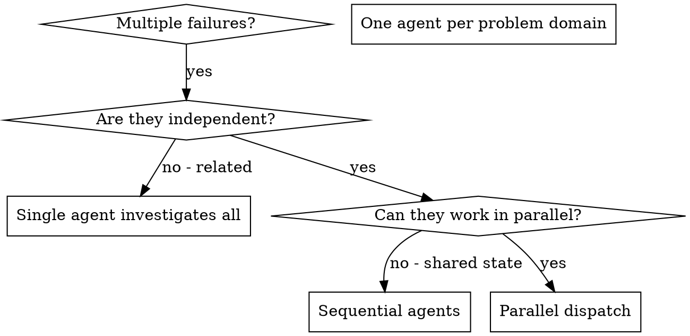
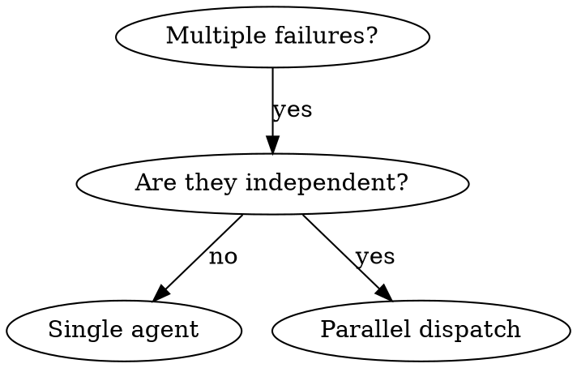

> 作者：大都督周瑜
> 公众号：IT周瑜
> 微信：it_zhouyu
> 

## 并行派发代理

前面讲的子代理驱动开发是**串行**的：一个任务完成后再做下一个。但有些场景可以并行。

`dispatching-parallel-agents` Skill 解决的场景是：**2+ 个独立问题需要同时处理**。

Skill 用一个 DOT 流程图定义了什么时候该用并行派发，原版如下：



三个判断：有没有多个失败？是否独立？能否并行工作？只有三个条件都满足才走并行派发。

"多个失败"不是指测试数量多，而是指**失败是否涉及 2 个以上不同的问题域**。RateLimitTest 挂了 3 个不算——虽然失败多，但都属同一个域，一个代理就能搞定。AuthControllerTest 挂 2 个 + RateLimitTest 挂 3 个才算——两个不同域，分别修才有并行的价值。判断时机是跑完测试、看到了失败分组之后，不是一看到红灯就并行。

这个 Skill 没有固定的触发阶段。它靠 `using-superpowers` 的 1% 规则条件触发——只要 AI 识别到当前场景可能涉及多个独立任务，就会被调用。可能在调试时、执行计划时、甚至在你随口说一句"帮我修一下这几个 bug"时。调用 Skill 也不等于走并行派发，Skill 内部的 DOT 流程图还会再判断一次是否真的该并行。

### 场景

假设 auth API 在一次重构后，有 3 组测试失败了：

```
AuthControllerTest: 2 failures — 手机号格式验证相关
JwtServiceTest: 1 failure — Token 过期判断相关
RateLimitTest: 3 failures — 限流机制相关
```

### 判断是否独立

并行派发的前提是问题之间**互不依赖**。判断标准：

| 问题 | 修复它会影响其他吗？ | 独立？ |
|------|-------------------|--------|
| 手机号格式验证 | 只改 Controller 层的校验逻辑 | 独立 |
| Token 过期判断 | 只改 JwtService 的过期逻辑 | 独立 |
| 限流机制 | 只改 RateLimitFilter | 独立 |

修复一个不会影响其他——可以并行。如果其中一个问题的修复会改动另一个问题依赖的代码，就不能并行。

### 派发

```typescript
// 三个子代理同时派发
Task("Fix AuthControllerTest: 手机号格式验证 2 个失败测试")
Task("Fix JwtServiceTest: Token 过期判断 1 个失败测试")
Task("Fix RateLimitTest: 限流机制 3 个失败测试")
```

每个子代理的 prompt 必须满足三个条件：

**1. 聚焦**：只给一个明确的问题域，不要说"修复所有测试"。

**2. 自包含**：所有需要的上下文都在 prompt 里。子代理看不到你的会话历史。

**3. 明确输出**：告诉它返回什么格式的结果。

好的 prompt 示例：

```
Fix the 2 failing tests in AuthControllerTest:

1. "shouldRejectInvalidPhoneFormat" - expects 400 but got 200
2. "shouldRejectEmptyPhone" - expects 400 but got 200

Phone validation was previously in AuthService but was removed during refactoring.
The controller should now handle validation before calling the service.

Your task:
1. Read the test file and understand what each test verifies
2. Add @Valid annotation and proper error handling in the controller
3. Run tests to verify fixes

Do NOT change other files. Return: summary of what you fixed.
```

### 结果集成

三个子代理返回后，当前主会话需要：

**1. 审查每个结果**：看每个子代理做了什么修改。

**2. 检查冲突**：三个子代理是否改了同一个文件？如果改了，手动解决冲突。

**3. 运行全量测试**：每个子代理只验证了自己负责的测试，但修改可能影响其他测试。运行全量测试确认。

```
Agent 1: 在 Controller 中添加 @Valid 和手机号格式校验
Agent 2: 修复 JwtService 中的过期时间比较逻辑（Instant 比较方向反了）
Agent 3: 修复 RateLimitFilter 中的计数器重置逻辑

Integration: 无冲突，mvn test 全量通过，15/15 tests pass
```

### 什么时候不该用

| 场景 | 原因 |
|------|------|
| 失败是同一个根因 | 修一个可能修全部，先调查 |
| 需要理解完整系统状态 | 并行子代理各看各的，没有全局视角 |
| 还不知道什么坏了 | 先做探索性调试，找到根因再决定 |
| 会编辑同一个文件 | 子代理互相覆盖 |

## using-git-worktrees 深入

前面我们在子代理驱动开发中使用了 worktree，但没有深入讲。现在来看看 `using-git-worktrees` Skill 的完整流程。

### Git Worktree 是什么

`git worktree` 让同一个仓库同时拥有多个工作目录，每个目录在不同分支上。

普通 git 工作流，同一时刻只能在一个分支上工作。切换分支要 `git checkout` 或 `git switch`，这会带来几个麻烦：

| 问题 | 例子 |
|------|------|
| 切分支前要 stash 或 commit | 在 feature-A 上改了一半，突然要修个紧急 bug |
| 多个任务来回切换容易乱 | 一会儿切 feature-A，一会儿切 feature-B，改着改着不知道自己在哪个分支 |
| 子代理并行工作冲突 | 两个子代理都要改文件，但都在同一个工作目录里，互相覆盖 |

`git worktree add ../feature-a feature-a` 会创建一个新的目录，这个目录独立于主工作目录、有自己的文件系统状态、自动切到指定分支，但共享同一个 `.git` 仓库（commit 历史、远程配置都是同一份）：

```
repo/                    ← 主工作目录，在 main 分支
├── .git/
└── src/

.worktrees/
├── feature-a/           ← worktree 1，在 feature-a 分支
│   └── src/
└── fix-bug/             ← worktree 2，在 fix-bug 分支
    └── src/
```

三个目录可以同时存在，互不干扰。在 `feature-a/` 里改文件，完全不影响 `repo/` 和 `fix-bug/`。

你可能会想，多 `git clone` 几份不也能达到同样效果？worktree 和 clone 的区别：

| 对比 | git worktree | git clone 多份 |
|------|-------------|---------------|
| 磁盘占用 | 小（共享 .git） | 大（每份完整仓库） |
| commit 历史 | 实时共享 | 各自独立，要 push/pull 同步 |
| 分支锁定 | 同一分支不能同时 checkout 到两个 worktree | 无此限制 |
| 创建速度 | 快 | 慢 |

在 Superpowers 里，worktree 的主要用途是给子代理提供隔离的工作空间：子代理在独立的 worktree 里工作，不会互相覆盖文件，主工作目录也保持干净。完成后 `git worktree remove` 删掉对应目录即可。

### Step 0：检测已有隔离

Skill 的第一步不是创建 worktree，而是**检测你是否已经在隔离环境中**：

```bash
GIT_DIR=$(cd "$(git rev-parse --git-dir)" 2>/dev/null && pwd -P)
GIT_COMMON=$(cd "$(git rev-parse --git-common-dir)" 2>/dev/null && pwd -P)
```

如果 `GIT_DIR != GIT_COMMON`，你已经在 worktree 中了——不需要再创建。

这里有一个容易踩的坑：**子模块（submodule）也会导致 `GIT_DIR != GIT_COMMON`**。Skill 加了一个保护：

```bash
# 如果返回了路径，你在子模块中，不是 worktree
git rev-parse --show-superproject-working-tree 2>/dev/null
```

先排除子模块的情况，再判断是否已在 worktree 中。

### Step 1a vs Step 1b：两种创建方式

Skill 优先使用平台的原生工具（Step 1a），只在没有原生工具时才用 git 命令（Step 1b）。

**Step 1a：原生工具**

如果你的平台有 `EnterWorktree`、`WorktreeCreate` 等原生工具，用它。原生工具自动处理目录放置、分支创建和清理。用 `git worktree add` 绕过原生工具会造成"宿主环境看不到的幻影状态"。

**Step 1b：git worktree 回退**

没有原生工具时，手动用 git 创建。目录选择有优先级：

1. 用户在指令中指定的目录（最高优先级）
2. 项目中已有的 `.worktrees/` 或 `worktrees/`
3. 全局目录 `~/.config/superpowers/worktrees/`
4. 默认 `.worktrees/`

创建前必须验证目录在 `.gitignore` 中——否则 worktree 的内容会被 git 追踪。

### 为什么顺序重要

先检测再创建，先原生再回退。这个顺序不是随意定的，而是从实际使用中总结的教训：

- 跳过检测 → 在已有 worktree 中再创建 worktree（嵌套）
- 跳过原生工具 → 宿主环境无法管理和清理
- 跳过 .gitignore 验证 → worktree 内容污染 git 状态

每一条都是真实踩过的坑。

## 自定义 Skill

Superpowers 的 14 个 Skill 覆盖了通用的开发流程。但你可能有自己的特殊需求——比如你的团队有特定的 commit message 格式要求，或者你的项目有独特的部署流程。这时候就需要写自定义 Skill。

`writing-skills` 是 Superpowers 里最"元"的 Skill——它教你如何写 Skill。而且它本身就是用 TDD 方法来写的。

### Description Trap：Skill 设计中最重要的发现

在讲怎么写 Skill 之前，必须先理解一个关键概念：**Description Trap（描述陷阱）**。

Skill 文件有一个 `description` 字段，用来告诉 AI 什么时候该用这个 Skill。Superpowers 在测试中发现了一个惊人的行为：

> 当 description 中总结了 Skill 的工作流程时，AI 会直接按 description 执行，而不去读完整的 Skill 内容。

举个例子。subagent-driven-development 的 description 曾经写成：

```yaml
# 坏：描述中包含了工作流程
description: Use when executing plans - dispatches subagent per task with code review between tasks
```

结果 AI 看到"dispatches subagent per task with code review between tasks"后，**只做了一次代码审查**。而完整的 Skill 里用 DOT 流程图明确写了**两级审查**（Spec Review + Code Quality Review）。

把 description 改成只写触发条件：

```yaml
# 好：只写触发条件，不写工作流程
description: Use when executing implementation plans with independent tasks in the current session
```

AI 就会去读完整的 Skill 内容，正确执行两级审查。

这就是 Description Trap：**description 总结了什么，AI 就只做什么**。description 变成了一个"捷径"，AI 用它替代了阅读完整内容。

这个发现的实用意义是：**description 只写 WHEN（什么时候用），永远不写 WHAT（做什么）**。

### CSO：Claude 搜索优化

writing-skills 提出了 CSO（Claude Search Optimization）的概念——类似 SEO，但针对 AI 的技能发现。

CSO 的核心原则：

**1. description 只写触发条件**

```yaml
# 坏：太抽象
description: For async testing

# 坏：第一人称
description: I can help you with async tests

# 好：具体的触发症状
description: Use when tests have race conditions, timing dependencies, or pass/fail inconsistently
```

**2. 关键词覆盖**

在 Skill 内容中使用 AI 会搜索的词：错误信息（"Hook timed out"）、症状（"flaky"、"hanging"）、同义词（"timeout/hang/freeze"）。

**3. 命名用主动语态**

```
✅ condition-based-waiting > async-test-helpers
✅ root-cause-tracing > debugging-techniques
✅ creating-skills > skill-creation
```

**4. Token 效率**

每个 Token 都有价值，因为 using-superpowers 的内容在每次会话启动时都要加载：

| Skill 类型 | 目标字数 |
|-----------|---------|
| getting-started 类 | < 150 词 |
| 频繁加载类 | < 200 词 |
| 其他 Skill | < 500 词 |

### DOT 流程图：可执行规范

Superpowers 大量使用 DOT/GraphViz 格式的流程图。这不是装饰，而是**可执行规范**。

writing-skills 明确说：AI 遵循 DOT 流程图的可靠性远高于遵循文字描述。原因可能在于：

- 流程图有明确的结构和分支，没有歧义
- 节点名称本身就是指令，不需要从自然语言中提取意图
- 分支条件直接写在边上，不会遗漏



这段流程图比"如果有多个独立的失败，使用并行派发"更不容易被误解。

但流程图也不能滥用。Skill 说：**只在决策不显而易见时使用流程图**。参考材料用表格，代码用 markdown 代码块，线性指令用编号列表。

### 用 TDD 方法写 Skill

writing-skills 把 Skill 开发映射到了 TDD 的 RED-GREEN-REFACTOR 循环，原版映射表：

| TDD Concept | Skill Creation |
|-------------|----------------|
| **Test case** | Pressure scenario with subagent |
| **Production code** | Skill document (SKILL.md) |
| **Test fails (RED)** | Agent violates rule without skill (baseline) |
| **Test passes (GREEN)** | Agent complies with skill present |
| **Refactor** | Close loopholes while maintaining compliance |
| **Write test first** | Run baseline scenario BEFORE writing skill |
| **Watch it fail** | Document exact rationalizations agent uses |
| **Minimal code** | Write skill addressing those specific violations |
| **Watch it pass** | Verify agent now complies |
| **Refactor cycle** | Find new rationalizations → plug → re-verify |

**RED 阶段**：派发一个子代理，给它一个压力场景，但**不提供 Skill**。记录子代理的行为：它做了什么选择？用了什么借口来违反规则？哪些压力触发了违规？

**GREEN 阶段**：写 Skill 来解决 RED 阶段发现的具体问题。然后用同样的场景测试——子代理现在应该遵守规则了。

**REFACTOR 阶段**：子代理找到了新的借口来违反规则？加一条明确的反驳。再测试。直到"防弹"。

### 实操：写一个 commit-convention Skill

假设你的团队要求 commit message 必须符合 `type(scope): description` 格式。我们用 writing-skills 的方法来写。

**RED**：派发子代理，让它在一个项目中提交代码，但不告诉它 commit message 格式要求。记录它的提交消息——可能是 `fix bug`、`update code` 这种随意格式。

**GREEN**：写一个 Skill：

```markdown
name: commit-convention
description: Use before any git commit to validate message format
# Commit Convention

## Rule

All commit messages must follow: type(scope): description

Types: feat, fix, refactor, test, docs, chore, style

Examples:
- feat(auth): add phone validation
- fix(jwt): correct token expiration check
- refactor(controller): extract validation logic

## Validation

Before committing:
1. Check message matches pattern
2. Check type is valid
3. If invalid, reformat before committing
```

用同样的场景测试——子代理现在应该自动格式化 commit message 了。

**REFACTOR**：如果子代理找到了漏洞（比如用了 `feat(Auth)` 大写开头），就加一条规则：

```markdown
## Common Mistakes
- Scope must be lowercase: `feat(auth)` not `feat(Auth)`
```

再测试，直到所有违规都被堵住。

## 14 个 Skill 快速参考

最后用一个表格回顾 Superpowers 的全部 14 个 Skill：

| Skill | 核心规则 |
|-------|---------|
| using-superpowers | 1% 规则：哪怕只有 1% 可能适用，就必须调用 |
| brainstorming | HARD-GATE：设计批准前不写代码，每次只问一个问题 |
| writing-plans | No Placeholders：每个 step 必须有完整代码和命令 |
| subagent-driven-development | 两级审查：Spec Review 先行，Code Quality Review 在后 |
| test-driven-development | Iron Law：没有失败测试不写生产代码 |
| systematic-debugging | 四阶段：根因 → 模式 → 假设 → 实现，3 次失败质疑架构 |
| verification-before-completion | Gate Function 5 步：没有验证证据不能声称完成 |
| requesting-code-review | 基于 git SHA 定义范围，反馈分 Critical/Important/Minor |
| receiving-code-review | 禁止表演性同意，YAGNI 检查，不清楚先问 |
| finishing-a-development-branch | 6 步流程：验证 → 检测 → 基准 → 选项 → 执行 → 清理 |
| dispatching-parallel-agents | 2+ 独立问题并行派发，结果集成要检查冲突 |
| using-git-worktrees | Step 0 先检测，Step 1a 原生优先，Step 1b git 回退 |
| executing-plans | 不支持子代理平台的备选：批量执行 + 检查点 |
| writing-skills | Description Trap：description 只写 WHEN 不写 WHAT |

Superpowers 的本质不是 14 个工具，而是一套**用规则和流程对抗 AI 不良倾向**的方法论。1% 规则对抗"跳过流程"、HARD-GATE 对抗"急着实现"、Red Flags 表对抗"自我辩解"、Iron Law 对抗"先写代码再补测试"、Gate Function 对抗"声称完成但没验证"。

这些规则不是随意设计的——每一条背后都有真实的失败案例和大量测试。理解了这些设计意图，你不仅能用好 Superpowers，还能用 writing-skills 的方法写出适合自己团队的自定义 Skill。
